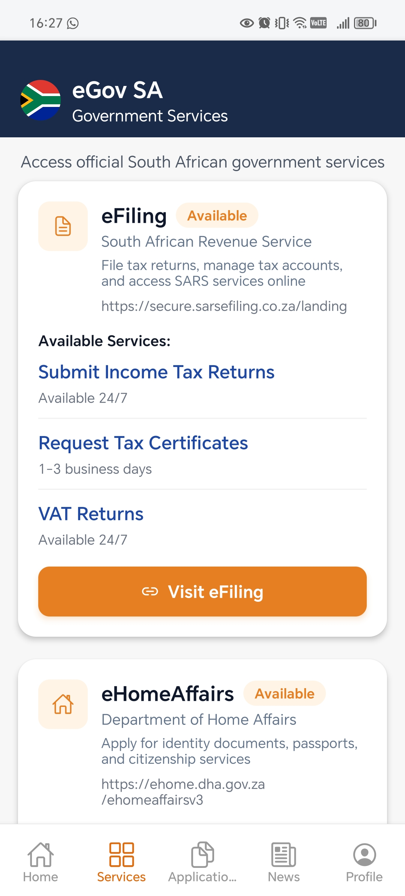
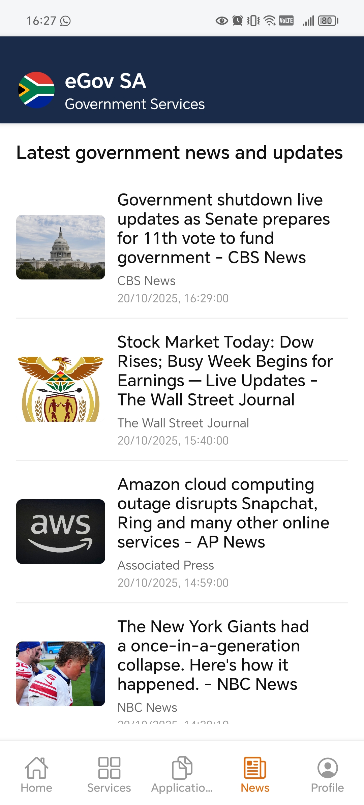

# eGov SA - Government Services Platform 🇿🇦

<div align="center">
  
  
  
  
</div>

## 📱 About

**eGov SA** is a comprehensive mobile application that centralizes official South African government services into a single, user-friendly platform. The app provides citizens with seamless access to essential government services including document applications, tax filing, vehicle registration, and more.

### Key Features

- 🏛️ **Integrated Government Services**: Access to eHomeAffairs, eNatis, and eFiling
- 📄 **Document Applications**: Apply for passports, Smart ID cards, birth certificates, and driving licenses
- 💰 **Tax Services**: Submit income tax returns, VAT returns, and request tax certificates
- 🚗 **Vehicle Services**: Learner's license applications, driving license renewals, and vehicle registration
- 📰 **News & Updates**: Stay informed with latest government news and updates
- 📅 **Appointment Management**: Schedule and track appointments with government offices
- 🔔 **Push Notifications**: Receive real-time updates on application status
- 🔐 **Secure Authentication**: Email OTP and PIN-based authentication system

## 🖼️ Screenshots

<div align="center">
  
  
  
  
  
</div>

## Version 2
Cleaner UI and now supports Dark mode
<div align="center">
  
  
  
  
  
  
  
</div>


### App Screens

- **Home**: Personalized dashboard with quick access to services and notifications
- **Services**: Browse and access integrated government service platforms
- **Applications**: Track active, completed, and rejected applications
- **News**: Latest government news and announcements
- **Profile**: Manage personal information, payment methods, and appointments

## 🏗️ Architecture

### Frontend (Mobile App)
- **Framework**: React Native with Expo
- **Navigation**: Expo Router (file-based routing)
- **Language**: TypeScript
- **State Management**: React Context API
- **Authentication**: Custom auth context with Supabase integration
- **Notifications**: Expo Notifications API

### Backend
- **Framework**: Spring Boot (Java)
- **Database**: Supabase (PostgreSQL)
- **API Architecture**: RESTful APIs
- **Controllers**:
  - `ApplicationController`: Manage service applications
  - `AppointmentController`: Handle appointment scheduling
  - `NotificationController`: Push notification management
  - `HomeController`: Dashboard data aggregation

### Project Structure

```
eGovSA/
├── app/                          # React Native app (Expo Router)
│   ├── (tabs)/                   # Tab-based navigation
│   │   ├── home.tsx
│   │   ├── applications.tsx
│   │   ├── news.tsx
│   │   ├── profile.tsx
│   │   └── services/             # Service-specific screens
│   ├── login/                    # Authentication flow
│   └── profile/                  # Profile management screens
├── src/
│   ├── components/               # Reusable React components
│   ├── contexts/                 # React Context providers
│   └── lib/                      # Utility libraries and API clients
├── eGovSa-Backend/              # Spring Boot backend
│   └── src/main/java/org/itmda/egovsabackend/
│       ├── controller/           # REST API controllers
│       ├── dto/                  # Data Transfer Objects
│       ├── entity/               # JPA entities
│       ├── repository/           # Data repositories
│       └── service/              # Business logic services
└── assets/                       # Static assets and images
```

## 🚀 Getting Started

### Prerequisites

- Node.js (v16 or higher)
- npm or yarn
- Java 17 or higher (for backend)
- Maven (for backend)
- Expo CLI
- Android Studio or Xcode (for mobile development)

### Frontend Setup

1. **Clone the repository**
   ```bash
   git clone https://github.com/Eppsidy/eGovSA.git
   cd eGovSA
   ```

2. **Install dependencies**
   ```bash
   npm install
   ```

3. **Configure environment variables**
   - Create a `.env` file in the root directory
   - Add your Supabase credentials and API endpoints

4. **Start the development server**
   ```bash
   npx expo start
   ```

5. **Run on your device**
   - Scan the QR code with Expo Go app (Android/iOS)
   - Press `a` for Android emulator
   - Press `i` for iOS simulator

### Backend Setup

1. **Navigate to backend directory**
   ```bash
   cd eGovSa-Backend
   ```

2. **Configure database**
   - Update `src/main/resources/application.properties` with your database credentials
   - Run the database setup scripts:
     ```bash
     # Located in project root
     database-setup.sql
     database-migrate-profiles.sql
     ```

3. **Build and run the backend**
   ```bash
   # Windows
   ./mvnw spring-boot:run
   
   # Linux/macOS
   ./mvnw spring-boot:run
   ```

   The backend API will be available at `http://localhost:8080`

## 🔌 Available Services

### eHomeAffairs
- Department of Home Affairs integration
- Identity documents (Smart ID, ID Book)
- Passport applications
- Birth certificates
- Citizenship services

### eNatis
- National Traffic Information System
- Learner's license applications
- Driving license renewals
- Vehicle registration
- License disc renewals

### eFiling
- South African Revenue Service (SARS)
- Submit income tax returns (24/7 availability)
- Request tax certificates (1-3 business days)
- VAT returns (24/7 availability)
- Manage tax accounts

## 📚 API Documentation

For detailed API documentation, refer to:
- [API Integration Guide](API_INTEGRATION.md)
- [Backend API Flow](BACKEND_API_FLOW_EXPLANATION.md)
- [Applications API](BACKEND_APPLICATIONS_API.md)

## 🧪 Testing

```bash
# Run frontend tests
npm test

# Run backend tests
cd eGovSa-Backend
./mvnw test
```

## 📱 Build for Production

### Android
```bash
# Build APK
npx expo build:android

# Build AAB for Play Store
eas build --platform android
```

### iOS
```bash
# Build for iOS
eas build --platform ios
```

## 🤝 Contributing

Contributions are welcome! Please follow these steps:

1. Fork the repository
2. Create a feature branch (`git checkout -b feature/AmazingFeature`)
3. Commit your changes (`git commit -m 'Add some AmazingFeature'`)
4. Push to the branch (`git push origin feature/AmazingFeature`)
5. Open a Pull Request

## 📄 License

This project is licensed under the MIT License - see the LICENSE file for details.

## 👥 Authors & Contributors

- **Tlhonolofatso Ramokhoase** - *Developer* - [Eppsidy](https://github.com/Eppsidy)
- **Nyuleka Mashicolo** - *Developer* - [GitHub](https://github.com/Daisy543)
- **Rearabile Charity** - *Developer* - [RCharity](https://github.com/RCharity)
- **Tshegofatso Ramokopu** - *Developer* - [Tshego-eng](https://github.com/Tshego-eng)

## 🙏 Acknowledgments

- South African Government for service integration support
- Expo team for the excellent React Native framework
- Spring Boot community for backend framework
- All contributors who have helped shape this project

## 📞 Support

For support, please contact:
- Email: support@egovsa.co.za
- GitHub Issues: [Report an issue](https://github.com/Eppsidy/eGovSA/issues)

---

<div align="center">
  Made with ❤️ for South African citizens
</div>
